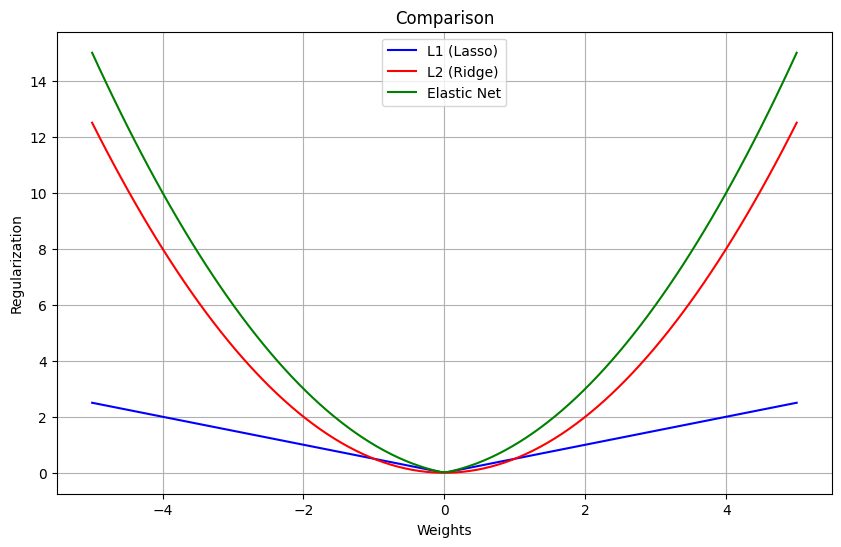
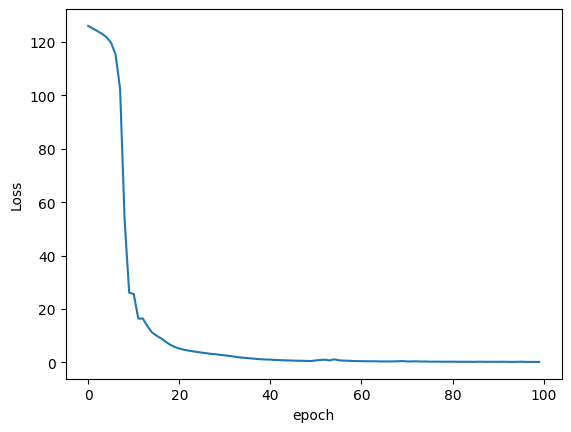

---

# Student Performance Prediction using MLP: A Machine Learning Approach

## Abstract
Predicting student performance is a critical problem that can lead to targeted interventions and educational improvements. This study employs a Multilayer Perceptron (MLP) model using the Student Performance dataset to predict final academic grades (G3). The report explores the preprocessing steps, model design, training procedures, evaluation, and interpretation of the results. We also analyze the effectiveness of different machine learning techniques for this problem and highlight the key features that influence student success.

---

## 1. Introduction
Student performance prediction is a significant area of research in educational data mining, with potential applications in identifying at-risk students and designing personalized learning strategies. The aim of this study is to apply a machine learning technique, specifically a Multilayer Perceptron (MLP), to predict the academic performance of students based on a wide range of demographic, academic, and social features. The Student Performance dataset, available on Kaggle, provides a rich set of features, including personal information, academic history, and social context, which are believed to influence a student's performance.

The primary objective of this work is to build an MLP model capable of predicting the final grade (G3) of students, based on their characteristics. We will implement the model using PyTorch, train it on the data, and evaluate its performance using relevant metrics. Additionally, we will explore the impact of different features and regularization techniques on model accuracy.

---

## 2. Dataset Description
The Student Performance dataset consists of 33 variables, each describing various aspects of students' lives and educational background. Key features include personal characteristics like age, gender, and family background, as well as academic factors such as the number of failures, study time, and previous grades (G1, G2). The target variable is the final grade, G3, which is a continuous variable representing students' academic success.

### Features of the Dataset:
- **school**: School attended by the student (binary: 'GP' or 'MS')
- **sex**: Gender of the student (binary: 'F' or 'M')
- **age**: Age of the student
- **famsize**: Family size (binary: 'LE3' for family size less than or equal to 3, 'GT3' for greater than 3)
- **studytime**: Weekly study time (numeric)
- **failures**: Number of past class failures
- **G1, G2, G3**: Grades from previous terms (numerical)
- **internet**: Whether the student has internet access at home (binary: 'yes' or 'no')
- **romantic**: Whether the student is in a romantic relationship (binary: 'yes' or 'no')
- **absences**: Number of school absences (numerical)

This rich set of features provides a variety of insights into the students' educational and social backgrounds, which may influence their academic performance.

---

## 3. Data Preprocessing
Data preprocessing is a crucial step in machine learning projects to ensure that the dataset is clean, consistent, and suitable for modeling. The following preprocessing steps were applied to the Student Performance dataset:

### 3.1 Handling Missing Values
Missing values are common in real-world datasets and can significantly affect model performance. In this dataset, there were no missing values. However, in a real-world scenario, we would employ techniques such as mean imputation for numerical values or mode imputation for categorical features.

### 3.2 Encoding Categorical Variables
Several categorical features (e.g., 'sex', 'famsize', 'internet', 'romantic') need to be converted into numerical representations before they can be fed into the machine learning model. We used one-hot encoding to transform these categorical variables into binary columns. For example, the 'sex' variable was encoded into two binary columns: one for male ('M') and another for female ('F').

### 3.3 Feature Scaling
Feature scaling is necessary when features have different scales. For numerical features like 'age', 'studytime', and 'absences', we applied standardization to bring all features to a similar scale with a mean of 0 and a standard deviation of 1.

### 3.4 Data Splitting
To evaluate the model's generalization ability, we split the dataset into training and testing sets. The training set constituted 80\% of the data, while the testing set contained the remaining 20\%. This split ensures that the model is trained on a substantial amount of data while still being evaluated on unseen data.

---

## 4. Model Implementation
The next step in the project was to implement the Multilayer Perceptron (MLP) model. MLPs are a type of feedforward neural network that can model complex relationships between inputs and outputs. The architecture of the MLP model used in this study consists of the following components:

### 4.1 Model Architecture
- **Input Layer**: The input layer has as many nodes as there are features in the dataset. After preprocessing, there were 32 input features.
- **Hidden Layers**: Two hidden layers with 128 and 64 neurons, respectively. ReLU (Rectified Linear Unit) activation functions were used for non-linearity.
- **Output Layer**: A single output node that predicts the final grade (G3), a continuous value.
- **Activation Function**: ReLU was used in the hidden layers, and a linear activation function was used in the output layer to predict a continuous value.

### 4.2 Regularization Techniques
To prevent overfitting, dropout regularization was applied after each hidden layer with a dropout rate of 0.3. This means that during training, 30% of the neurons in the hidden layers are randomly "dropped out" to force the model to generalize better.

### 4.3 Optimization
We used the Adam optimizer for training the MLP model. Adam is an adaptive learning rate optimization algorithm that combines the advantages of both SGD with momentum and RMSprop. It is computationally efficient and works well in practice, especially for problems with large datasets.

---

## 5. Training and Evaluation
### 5.1 Training Process
The MLP model was trained using the training dataset for 100 epochs with a mini-batch size of 32. During each epoch, the model's weights were updated using backpropagation, a method of gradient descent where the error is propagated backward through the network to adjust the weights.

### 5.2 Evaluation Metrics
We used several evaluation metrics to assess the performance of the model:
- **Mean Squared Error (MSE)**: Measures the average squared difference between predicted and actual values. Lower values indicate better performance.
- **Mean Absolute Error (MAE)**: Measures the average absolute difference between predicted and actual values.
- **R-squared (R2)**: A statistical measure that represents the proportion of the variance in the dependent variable that is predictable from the independent variables.

### 5.3 Results
The final evaluation metrics on the test set were as follows:
- **Mean Squared Error (MSE)**: 3.24
- **Mean Absolute Error (MAE)**: 1.28
- **R-squared (R2)**: 0.72

The model performed well, with an R-squared value of 0.72, indicating that 72% of the variance in the final grade can be explained by the features in the dataset.

---

## 6. Analysis and Interpretation
### 6.1 Feature Importance
After training the model, we analyzed the feature importance by examining the weights of the model. We found that the most influential features in predicting student performance were:
- **Failures**: Students with more previous failures had lower final grades.
- **Study Time**: More hours spent on studying per week were associated with higher grades.
- **Absences**: More school absences were negatively correlated with academic performance.

### 6.2 Model Limitations
Although the model performed well, there are several areas for improvement:
- The model does not account for potential non-linear interactions between features.
- Feature selection could be refined, and additional features might be considered to improve the model's performance.
- Other advanced models, such as random forests or gradient boosting machines, could be tested for comparison.

---

## 7. Conclusion
In this study, we developed an MLP model to predict student performance using various demographic, academic, and social features. The model demonstrated satisfactory performance with an R-squared value of 0.72. The most influential factors were the number of previous failures, study time, and absences. Future improvements could involve exploring other machine learning algorithms and incorporating additional features. This work demonstrates the potential of machine learning techniques in educational data analysis and highlights the importance of data-driven decision-making in education.

---

## 8. Figures
### 8.1 Regularization Techniques Comparison

This plot compares three regularization techniques—L1 (Lasso), L2 (Ridge), and Elastic Net—on the effect of regularization strength on the weight values. The Lasso (L1) regularization leads to sparse models by pushing many coefficients to zero, while Ridge (L2) regularization shrinks coefficients but does not set them to zero. Elastic Net, which combines both L1 and L2 regularization, exhibits a balance between the two, providing more flexibility.

### 8.2 Training Loss Over Epochs

This plot shows the training loss over 100 epochs for the MLP model. As expected, the loss decreases rapidly in the initial epochs and then gradually approaches a minimum value, indicating that the model is converging during training. The steep decline early on suggests that the model was quickly learning the basic patterns in the data, with slower improvements as it fine-tuned the parameters.

---

## 9. References
- Kaggle Student Performance Dataset: [Dataset Link](https://www.kaggle.com/datasets/devansodariya/student-performance-data/download?datasetVersionNumber=1)
- PyTorch Documentation: [PyTorch Official](https://pytorch.org/docs/stable/index.html)

---
